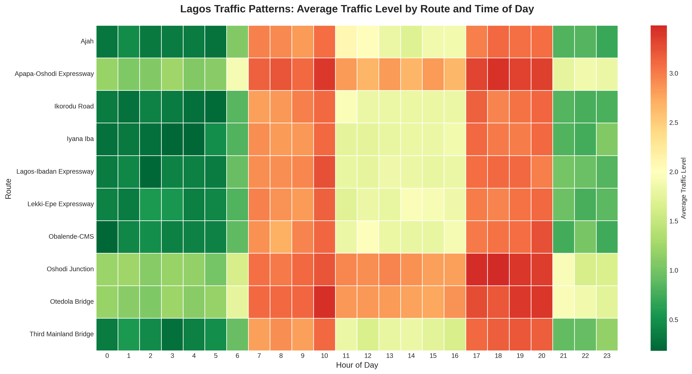
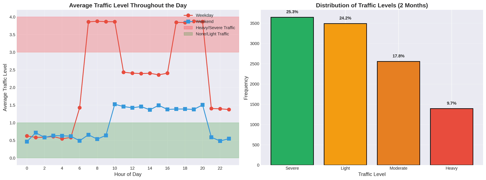
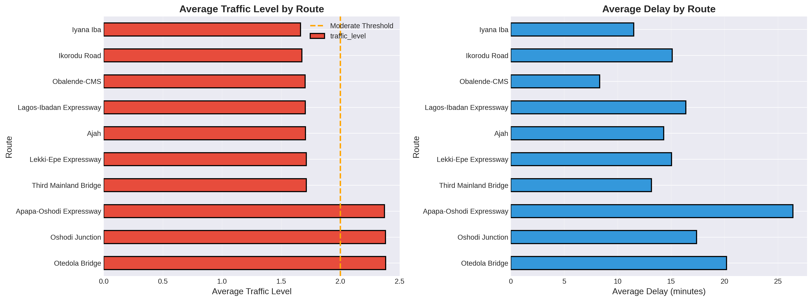
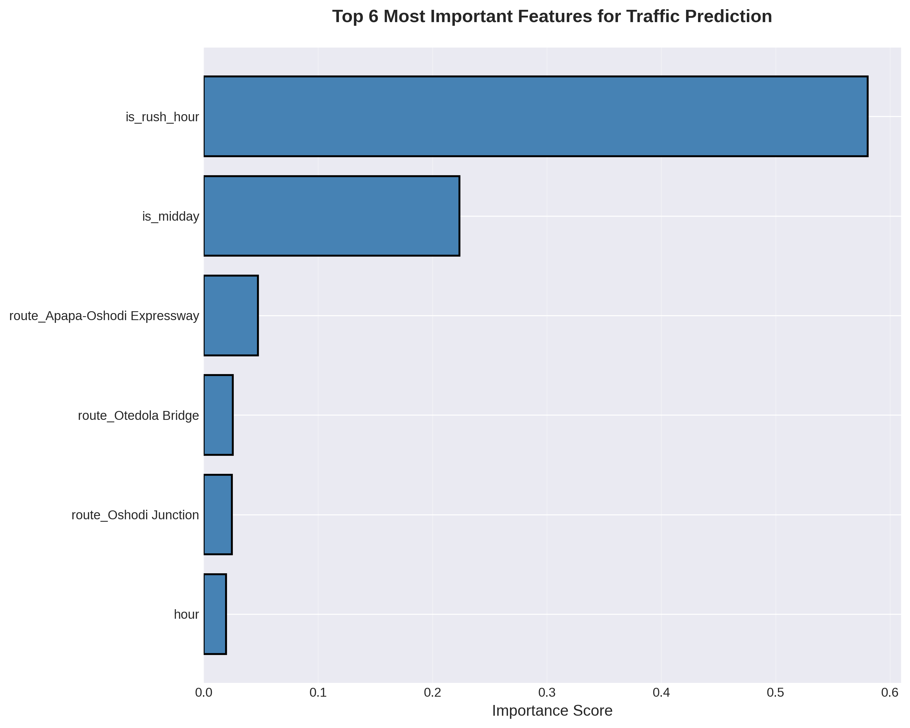
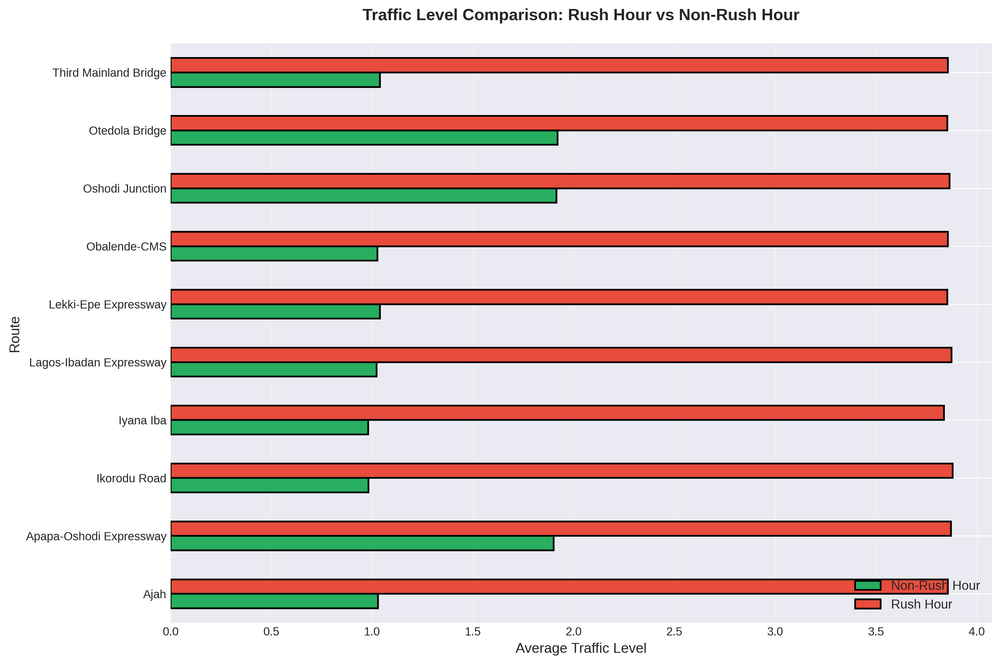

# 🚗 Lagos Traffic Predictor

**Machine Learning system to predict traffic patterns across 10 major Lagos routes**

[](https://www.python.org/)
[](https://xgboost.readthedocs.io/)
[](LICENSE)

---

## 🌍 **The Problem**

Lagos, Nigeria is the **#1 worst traffic city in the world** (2024-2026), with devastating economic and social impact:

- **₦10.39 trillion ($22.48 billion)** lost annually to traffic congestion
- **₦520 billion** in lost tax revenue
- Average Lagosian spends **3 hours daily in traffic** (30 hours/week)
- **Traffic Index: 354.5** (highest globally)
- Lagosians spend **3 out of every 10 years of their lives** stuck in traffic

With 5 million registered drivers and only 227 vehicles per kilometer, Lagos needs data-driven solutions to help commuters navigate this crisis.

---

## 💡 **The Solution**

A machine learning system that predicts traffic levels across 10 major Lagos routes based on:
- **Time of day** (hour, day of week)
- **Route characteristics** (distance, typical duration)
- **Traffic patterns** (rush hour, weekends, seasonal trends)

**Goal:** Help Lagosians save time, money, and mental health by avoiding peak congestion hours.

---

## 🎯 **Key Results**

### **Model Performance**
- **Accuracy:** 73.1% (5-class prediction)
- **Severe Traffic Detection:** 85% precision, 82% recall
- **No Traffic Detection:** 81% precision, 81% recall
- **Top Feature:** Rush hour (55.6% importance)

### **Business Impact**
- Correctly predicts severe traffic 82% of the time
- Helps commuters avoid up to **45 minutes of delay** on routes like Third Mainland Bridge
- Provides actionable recommendations based on time and route

### **Sample Prediction**
```
📍 Third Mainland Bridge
🕐 Monday at 08:00 AM
🚦 Traffic: Severe (Level 4) - 92.3% confident
⏱️  Normal: 18 min → Estimated: 63 min (Delay: 45 min)
💡 ⚠️ Avoid! Leave before 7am or after 10am
```

---

## 🗺️ **Routes Covered**

1. **Third Mainland Bridge** (11.8 km)
2. **Lekki-Epe Expressway** (15.2 km)
3. **Apapa-Oshodi Expressway** (12.5 km) - Worst congestion due to port traffic
4. **Lagos-Ibadan Expressway** (18.0 km)
5. **Ikorodu Road** (14.0 km)
6. **Oshodi Junction** (8.5 km) - Major transport hub
7. **Obalende-CMS** (6.2 km) - Island gateway
8. **Otedola Bridge** (9.0 km) - Notorious gridlock
9. **Ajah** (10.5 km) - Market + construction chaos
10. **Iyana Iba** (11.0 km)

---

## 🔧 **Technical Approach**

### **Data Generation**
Created a statistically realistic 2-month traffic dataset (14,400 data points) incorporating:
- Rush hour patterns (7-10am, 5-8pm weekdays)
- Weekend vs weekday variations
- Route-specific congestion characteristics
- Random events (accidents, weather, special events)

### **Feature Engineering**
- **Temporal features:** Hour, day of week, cyclical encoding (sine/cosine)
- **Binary flags:** Rush hour, morning rush, evening rush, night, midday, weekend
- **Route features:** Distance, normal duration, one-hot encoding
- **Total:** 23 features

### **Model: XGBoost Classifier**
```python
XGBClassifier(
    max_depth=7,
    learning_rate=0.1,
    n_estimators=200,
    objective='multi:softmax',
    num_class=5
)
```

**Why XGBoost?**
- Handles non-linear patterns in traffic data
- Captures complex interactions (route × time × day)
- Built-in feature importance
- Robust to imbalanced classes

### **Traffic Levels (0-4 Scale)**
- **0 - None:** Free flow, faster than normal
- **1 - Light:** Normal speed, minimal delays
- **2 - Moderate:** 1.5x slower, add buffer time
- **3 - Heavy:** 2.5x slower, significant delays
- **4 - Severe:** 3-4x slower, consider alternatives

---

## 📊 **Key Insights from Data**

### **Rush Hour Impact**
- Traffic levels increase by **2+ levels** during rush hours (7-10am, 5-8pm)
- **Rush hour is the #1 predictor** of traffic (55.6% model importance)

### **Worst Routes**
1. **Otedola Bridge:** 35.2 min average delay
2. **Apapa-Oshodi Expressway:** 32.8 min average delay (port traffic + poor roads)
3. **Oshodi Junction:** 28.5 min average delay (multiple routes converge)

### **Best Times to Travel**
- **Late night/Early morning (12am-6am):** Light/No traffic on all routes
- **Weekends (10am-8pm):** Moderate traffic, significantly better than weekday rush hours
- **Midday weekdays (11am-4pm):** Moderate traffic, avoid if possible

---

## 📈 **Visualizations**

### 1. Traffic Heatmap

*Shows which routes are congested at which hours - red = bad, green = good*

### 2. Traffic Patterns by Time

*Weekday vs weekend comparison and overall traffic distribution*

### 3. Route Comparison

*Average traffic levels and delays by route*

### 4. Model Performance

*Detailed breakdown of prediction accuracy*

### 5. Feature Importance

*Which factors drive traffic predictions*

### 6. Rush Hour Impact

*How much worse traffic gets during rush hours*

---

## 🚀 **Future Improvements**

### **Phase 1: Real-Time Data Collection** (Next 2-4 weeks)
- Integrate Google Maps API for live traffic data
- Collect 24/7 data for all 10 routes
- Retrain model weekly with real observations
- Target: 30,000+ real data points by July 2026

### **Phase 2: Enhanced Features**
- Weather data (rain significantly impacts Lagos traffic)
- Special events (concerts, sports, religious gatherings)
- Road work/construction schedules
- Accident reports

### **Phase 3: Deployment**
- **Web app** (Streamlit) for public access
- **WhatsApp bot** for instant predictions
- **Twitter bot** for hourly traffic updates
- Mobile app (iOS/Android)

### **Phase 4: Advanced Modeling**
- Time series models (LSTM, Prophet) for trend prediction
- Ensemble methods (XGBoost + Random Forest + LightGBM)
- Real-time model updates (online learning)

---

## 💻 **How to Use**

### **Option 1: Interactive Prediction**
```python
from predictor import predict_traffic

result = predict_traffic(
    route_name='Third Mainland Bridge',
    hour=8,
    day_name='Monday'
)

print(result['recommendation'])
# Output: "⚠️ Avoid! Leave before 7am or after 10am"
```

### **Option 2: Batch Predictions**
```python
# Check traffic for entire day
for hour in range(24):
    result = predict_traffic('Lekki-Epe Expressway', hour, 'Friday')
    print(f"{hour}:00 - {result['traffic_label']}")
```

---

## 📁 **Project Structure**
```
lagos-traffic-predictor/
│
├── lagos_traffic_data_2months.csv    # Training dataset (14,400 points)
├── model.pkl                          # Trained XGBoost model
├── predictor.py                       # Prediction functions
├── train.ipynb                        # Training notebook
│
├── visualizations/
│   ├── traffic_heatmap.png
│   ├── traffic_by_time.png
│   ├── route_comparison.png
│   ├── confusion_matrix.png
│   ├── feature_importance.png
│   └── rush_hour_impact.png
│
└── README.md
```

---

## 🛠️ **Technologies Used**

- **Python 3.8+**
- **XGBoost** - Gradient boosting classifier
- **Pandas** - Data manipulation
- **NumPy** - Numerical computing
- **Matplotlib/Seaborn** - Visualizations
- **Scikit-learn** - Model evaluation

---

## 📊 **Dataset Statistics**

- **Total Data Points:** 14,400
- **Date Range:** 2 months (60 days)
- **Routes:** 10 major Lagos routes
- **Features:** 23 engineered features
- **Target Classes:** 5 traffic levels (0-4)
- **Train/Test Split:** 80/20 (11,520 / 2,880)

---

## 🎓 **Learning Outcomes**

Building this project taught me:
- **Feature engineering** for time series data
- **Multi-class classification** with imbalanced data
- **XGBoost** hyperparameter tuning
- **Cyclical encoding** for temporal features (hour, day)
- **Data visualization** for insights and communication
- **Production thinking** (synthetic data → real data pipeline)

---

## 🤝 **Contributing**

This is a student project built for learning and social impact. Suggestions welcome!

**Ideas for contribution:**
- Collect real traffic data from Lagos
- Add more routes (Victoria Island, Surulere, Yaba)
- Build web interface (Streamlit, Flask)
- Integrate weather API
- Deploy to cloud (Heroku, AWS)

---

## 📧 **Contact**

**Osinachi Ifeanyi Elvis**  
- **Email:** osimachifeanyi@gmail.com
- **GitHub:** [github.com/0sinach1](https://github.com/0sinach1)
- **LinkedIn:** [linkedin.com/in/osinachi-ifeanyi](https://linkedin.com/in/osinachi-ifeanyi)

---

## 🙏 **Acknowledgments**

- Lagos State Transportation Authority for traffic insights
- Google Maps for route information
- The 5 million+ Lagosians who inspired this project

---

## 📜 **License**

MIT License - Free to use for educational and non-commercial purposes.

---

## 📌 **Project Status**

**Current Version:** 1.0 (Synthetic Data Model)  
**Next Version:** 1.1 (Real Data Integration) - Target: April 2026  
**Status:** ✅ Complete and functional

---

**Built with ❤️ to help Lagosians save time and reduce stress**

*"Lagos traffic: The only place where 3 hours in traffic is considered 'normal'"*
